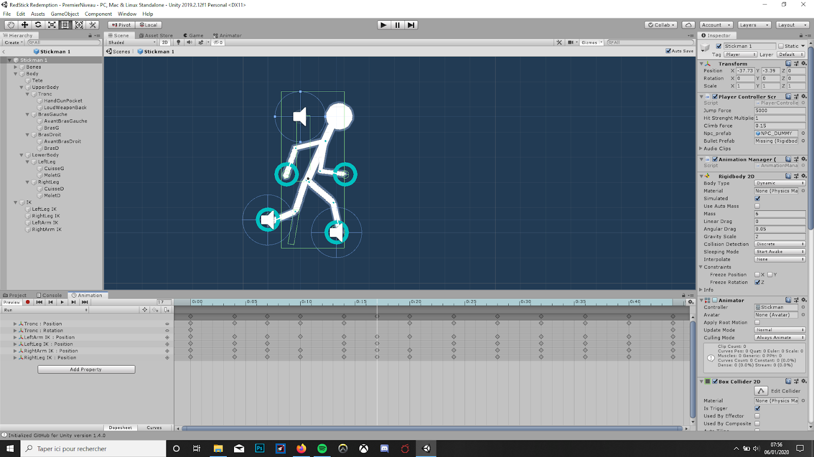
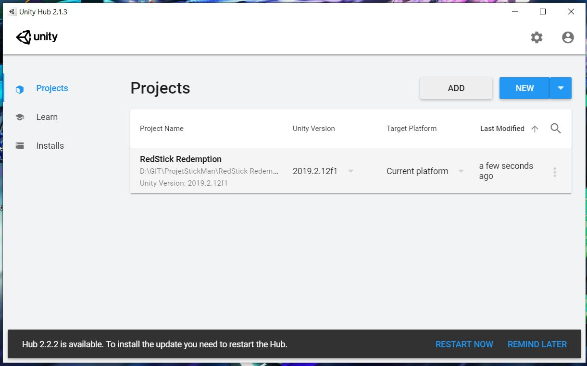

# ProjetStickMan


<!-- PROJECT LOGO -->
<br />
<p align="center">
  <a href="https://github.com/LucasSecret/ProjetStickMan">
    
  </a>

  <h3 align="center">Red Stick Redemption</h3>

  <p align="center">
    Bonjour et bienvenue dans le repo de Red Stick Redemtpion, un jeu vidéo mettant en scène un personnage de type "stickman" avec des mecanismes de gestion avancée d'animation et de cinématique inversée.
   <br />
  
  
  
  
  Ce projet a été réalisé avec <a href="https://unity.com/fr"><strong>Unity</strong></a> dans le cadre de l'unité d'enseignement <a href="http://perso.univ-lyon1.fr/fabien.rico/site/projet:start"><strong>LIFPROJET</strong></a> de l'université Claude Bernard Lyon 1.
  </p>
</p>


<!-- TABLE OF CONTENTS -->
##  Menu

* [A propos du projet](#a-propos-du-projet)
* [Construit avec](#construit-avec)
* [Comment compiler et tester le code](#comment-compiler-et-tester-le-code)
* [License](#license)
* [Contact](#contact)

<!-- ABOUT THE PROJECT -->
## A propos du projet

Ce projet se base sur un style de jeu vidéo relativement populaire dit des "stickmans".
<br />
Ce sont de petits personnages dont les particularitées sont, la simplification graphique d'une part, la gestion squeletique "bones" précise de l'autre.
<br />
La contrainte fixée était de réalisé une cinématique et une animation complète de notre joueur sans avoir recours a la facilité de colision classique ni à l'animation réalisé uniquement par sprite.
<br />




### Construit avec

* <a href="https://unity3d.com/get-unity/download"><strong>Unity</strong></a>
* <a href="https://assetstore.unity.com/packages/essentials/unity-anima2d-79840"><strong>Anima2D</strong></a>
* <a href="https://www.gitkraken.com/"><strong>GitKraken</strong></a>


### Comment compiler et tester le code

1. Afin de pouvoir tester et compiler ce projet, vous devez avant tout possèdez la version d'unity minimal : <a href="https://unity3d.com/get-unity/download"><strong>2019.2.12</strong></a>
<br />
<br />

2. Cloner le repo git :
```bash
git clone https://github.com/LucasSecret/ProjetStickMan.git
```
<br />
<br />

3. Ouvrir Unity Hub et vous pourrez importer le projet comme suit :

<br />

<!-- LICENSE -->
## License

Distributed under the MIT License. See `LICENSE` for more information.


<!-- CONTACT -->
## Contact

Michel Drevet - [@twitter_handle](https://twitter.com/twitter_handle) - michel.drevet@etu.univ-lyon1.fr :fr:
<br />
Lucas Secret - [@twitter_handle](https://twitter.com/twitter_handle) - lucas.secret@etu.univ-lyon1.fr :fr:
<br />
Liam Burk - [@twitter_handle](https://twitter.com/twitter_handle) - liam.burk@etu.univ-lyon1.fr :guatemala:

Project Link: [https://github.com/LucasSecret/ProjetStickMan](https://github.com/LucasSecret/ProjetStickMan)

Merci :slightly_smiling_face:
